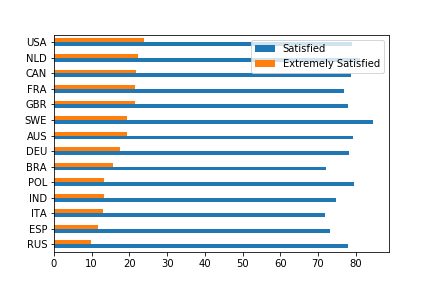

Developer careers across the globe: some comparisons
====================================================

How do salaries and career outcomes in the IT sector vary across
countries?  Evidently, culture and economic reality vary greatly
across the globe.  On the other hand, the IT sector is very
globalized.  How do these two facts play against each other?

The goal of this blog post is to gain some insight on this issue.  We
pose the following questions:

1. How do developer salaries vary across countries, in comparison with
   the general national income levels?
2. Can we observe a significant gender pay gap in the IT sector, and
   does that vary significantly across countries?
3. In which countries are developers the most satisfied with their
   jobs?
   
To tackle these questions, we analyze data from the 2018 StackOverflow
developer survey, and compare with other economic data from OECD and
Gallup.
   
Developer salaries across countries
-----------------------------------

The IT sector is very globalized, both in terms of the tools and
technologies available to developers in different countries, and in
terms of movement of workers.  This might lead us to suspect that
developer salaries in different countries do not vary as drastically
as the general national figures do.  On the other hand, your salary as
a developer depends a lot on *what kind* of development you do, and
the types of jobs available in different countries vary a lot too; so
this might counter the “globalization” effect.

To visualize how these forces (and others) play out, the figure below
shows the median national income in various countries and the median
income of respondents of the 2018 StackOverflow developer survey,
broken down by country.  We focus on those countries where at least
500 full-time employed survey respondents reported their salary.

What we see here is that the median developer income is above the
national median income everywhere, usually substantially so.  This
difference ranges from a 13% increase in Sweden to an 11-fold increase
(!!!) in India.

The figure above dispels any notion that the IT sector is more
egalitarian, in a comparison across countries.  But it is interesting
to note that the median developer salary in many less wealthy
countries is pretty much comparable with the general median income of
rich countries: compare Russia and Brazil with Spain and Italy, or
Poland with Germay, UK and France.

It's also interesting to compare developers salaries across countries
in terms of their purchasing power.  Here, we show the median
StackOverflow survey respondent salary adjusted by the PPP index.
Under this metric, we still see large differences across countries,
but some interesting things happen: Poland and Russia now get close,
or surpass, the richer Western European countries.  The median
purchase power of a developer in Brazil and India is comparable to
that of the general population in the developed countries.

**Notes.** The median income data is from a [Gallup
poll][wiki-median].  The PPP index can be found [on the OCDE
website][ppp].

Gender matters
--------------

It's no secret that the software industry has a serious gender balance
issue, at least when it comes the number of female workers in the
field.  This is the percentage of male survey respondents, among those
who reported a gender:

| ITA  | BRA  | SWE  | ESP  | POL  | DEU  | FRA  | NLD  | RUS  | AUS  | GBR  | IND  | CAN  | USA  |
| ---- | ---- | ---- | ---- | ---- | ---- | ---- | ---- | ---- | ---- | ---- | ---- | ---- | ---- |
| 96.9 | 95.6 | 95.1 | 94.4 | 94.2 | 94.2 | 94.0 | 93.6 | 93.6 | 92.8 | 92.6 | 92.5 | 89.6 | 89.5 | 

Now, one may ask if, once a female breaks into the field, there will
still be significant differences in their career outcome, compared the
her male peers.  One metric for this is the gender wage gap, defined
as follows by the OECD:

> The gender wage gap is defined as the difference between median
> earnings of men and women relative to median earnings of men. Data
> refer to full-time employees on the one hand and to self-employed on
> the other.

In other words, this is the percentage penalty, in median income,
received from being female.  The OECD provides this statistic for the
general workforce in several countries, and we computed the
corresponding value among survey respondents, restricting to the case
of full-time employees.

This result is striking.  First, it dispels any idea that the only
difference between men and woman, in career terms, is numerical.
Moreover, is little general relation between the wage gap in the IT
sector and in the broader workforce across countries.  Netherlands,
Germany and Canada fare comparatively well in pay balance for
developers, although this is not the case for the broader workforce;
and France, Spain and Australia, which have the best wage gap figures
for the broad workforce, do not look good, even in relative terms,
when we focus on the IT sector.

**Notes.** For the above analysis, we restricted to those countries
where at least 30 full-time employed female respondents reported a
salary.  This is a small quantity, so the reader is urged to take the
above with a pinch of salt.  The general [gender gap data][gender-gap]
is from the OECD.

Job satisfaction
----------------

To finish this post, we look at how job satisfaction of survey
respondents varies across our countries of interest.  We compute the
percentage of respondents who report to be at least slightly
satisfied, and the percentage who report being extremely satisfied.

As we see, the portion of satisfied respondents does not vary too
greatly, and tends to be in the 70% to 80% range.  When it comes to
being extremely satisfied, some countries fare better than others.
The wealthier countries tend to have more extremely satisfied
developers.

It might be an interesting topic for a future analysis to find out
which other surveyed factors account for high job satisfaction, and
how much of a developers job satisfaction can be credited to the
country of residence alone.

[wiki-median]: https://en.wikipedia.org/wiki/Median_income
[gender-gap]: https://data.oecd.org/earnwage/gender-wage-gap.htm
[ppp]: https://data.oecd.org/conversion/purchasing-power-parities-ppp.htm
